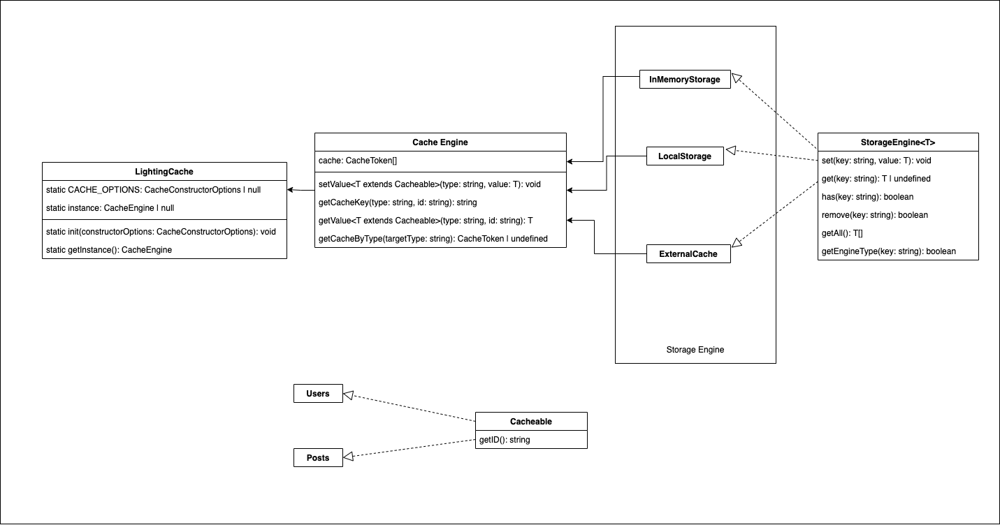

# Lightning Cache

Lightning Cache is designed as a way to allow the cache to manage where data is stored based on a single configuration. Currently only in memory storage is supported.

## Architecture

The following diagram was used in the design of the library:



This implements a bridge pattern within the Cache Engine <-> Storage Engine block. The Cache Engine loads cache `tokens` which describe how that block of the cache should act. Each of these `tokens` contains a storage engine. This engine is in charge of managing that map within the cache through the CacheEngine. This pattern allows the creation of any of any engine type, as long as it implements the StorageEngine Interface.

This library also utilizes the singleton patters within the LightningCache class to manage instance creation. This ensures that only one master cache is created. This means that multiple caches will not have to be synced due to an accidental creation of another.

## Installation

Run

```bash
npm install --save lightning-cache
```

To install.

## Usage

Lightning Cache must be initialized before usage. Import the module into your project by using:

```js
import { LightningCache } from 'lightning-cache';
```

Before we use Lightning Cache we must initialize the cache. We do this by passing the cache an initialization object. Currently there is only one key in this object which contains CacheTokens. The following is what a CacheToken looks like.

`CacheToken`:

```ts
{
    type: "users", //<-- Creates cache type key
    storageEngine: new InMemoryStorage(), // <-- Cache engine to use for that key
}
```

`ConstructorOptions:`

```ts
{
    tokens: CacheToken[]
}
```

Configure the cache by running

```ts
LightningCache.init(ConstructorOptions);
```

After LightningCache is configured, you can use the cache by calling:

```ts
LightningCache.getInstance();
```

## Methods

### LightningCache

`.init()` - Initialize the Cache with `CacheConstructorOptions`.

Example:

```js
LightningCache.init({
  tokens: [
    {
      type: 'users',
      storageEngine: new InMemoryStorage(),
    },
  ],
});
```

`.getInstance()` - Gets an instance of the CacheEngine - must call `.init()` first.

Example:

```js
LightningCache.init({
  tokens: [
    {
      type: 'users',
      storageEngine: new InMemoryStorage(),
    },
  ],
});

const cache = LightningCache.getInstance();
```

### CacheEngine

`.setValue<T extends Cacheable>(type: string, value: T)` - Sets the value of a cache key.

Example:

`User.js`

```js
export default class User {
  constructor(id, fName, lName) {
    this.id = id;
    this.fName = fName;
    this.lName = lName;
  }

  getID() {
    return this.id;
  }
}
```

`main.js`

```js
LightningCache.init({
  tokens: [
    {
      type: 'users',
      storageEngine: new InMemoryStorage(),
    },
  ],
});

const cache = LightningCache.getInstance();

const user1 = new User(1, 'Jane', 'Doe');

cache.setValue('users', user1);
```

`.getValue<T extends Cacheable>(type: string, id: string)` - Sets the value of a cache key.

Example:

`User.js`

```js
export default class User {
  constructor(id, fName, lName) {
    this.id = id;
    this.fName = fName;
    this.lName = lName;
  }

  getID() {
    return this.id;
  }
}
```

`main.js`

```js
LightningCache.init({
  tokens: [
    {
      type: 'users',
      storageEngine: new InMemoryStorage(),
    },
  ],
});

const cache = LightningCache.getInstance();

const user1 = new User(1, 'Jane', 'Doe');

cache.setValue('users', user1);

cache.getValue('users', user1.id);
```

## Interfaces

```ts
interface CacheToken {
  type: string;
  storageEngine: InMemoryStorage<any>;
  id: string; // <-- Currently optional
}
```

```ts
interface CacheConstructorOptions {
  tokens: CacheToken[];
}
```

```ts
interface Cacheable {
  getID(): string;
}
```
